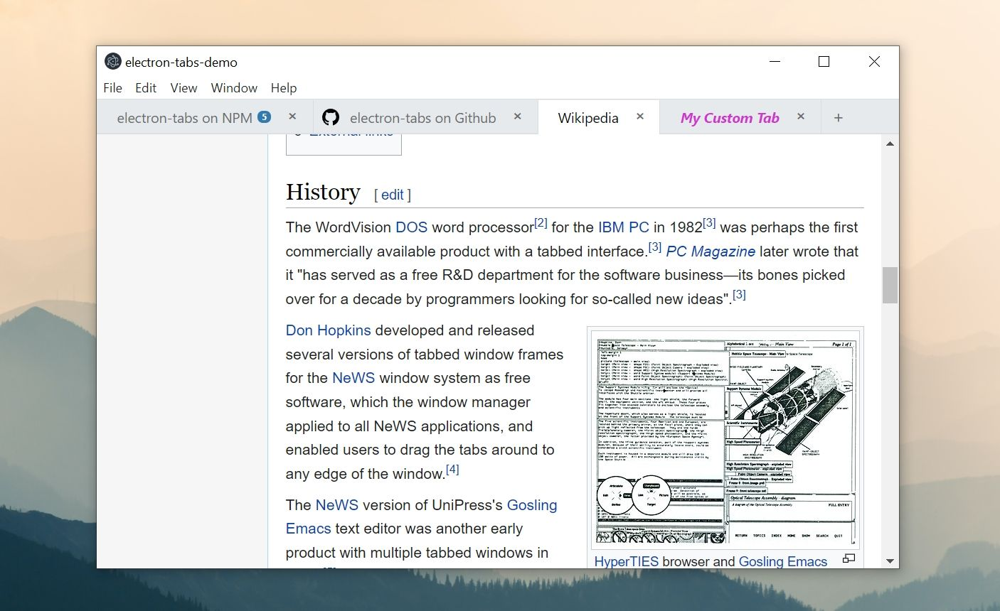

# electron-tabs is discontinued

Thank you for your support and contributions all these years.

---

# electron-tabs

> Simple tabs for Electron applications



## Features

* :electron: Compatible with Electron ≥ 17.
* :lock: Compliant with [Electron security recommendations](https://www.electronjs.org/docs/latest/tutorial/security) (works without `nodeIntegration: true`).
* :toolbox: Written with TypeScript and Web Components.
* :hand: Supports drag and drop out of the box.
* :art: Easily customizable.

## Installation

```bash
npm install --save electron-tabs
```

## Getting started

Define the following `webPreferences` options in the main process:

```js
const mainWindow = new electron.BrowserWindow({
  webPreferences: {
    webviewTag: true
  }
});
```

Then add the following markup where you want the tabs to display:

```html
<tab-group></tab-group>

<script src="node_modules/electron-tabs/dist/electron-tabs.js"></script>
```

## Options

You can add options by setting `<tab-group>` element attributes:

```html
<tab-group new-tab-button="true" sortable="true"></tab-group>
```

The following attributes are supported:

* `close-button-text` (string): text of the tabs "Close" button.
* `new-tab-button` (boolean): set it to true to display the "New Tab" button.
* `new-tab-button-text` (string): text of the "New Tab" button.
* `sortable` (boolean): set it to true to make the tabs sortable by drag and drop.
* `visibility-threshold` (number): the minimum number of tabs necessary for the tab bar to be displayed. 0 (default) means that it will always remain visible.

## Methods

Use `TabGroup` methods and manipulate tabs in a script after calling `electron-tabs.js`.

```html
<tab-group new-tab-button="true"></tab-group>

<script src="path/to/electron-tabs.js"></script>

<script>
  // Select tab-group
  const tabGroup = document.querySelector("tab-group");

  // Setup the default tab which is created when the "New Tab" button is clicked
  tabGroup.setDefaultTab({
    title: "New Page",
    src: "path/to/new-page.html",
    active: true
  });

  // Do stuff
  const tab = tabGroup.addTab({
    title: "electron-tabs on NPM",
    src: "https://www.npmjs.com/package/electron-tabs"
  });
  const pos = tab.getPosition();
  console.log("Tab position is " + pos);
</script>
```

### TabGroup

#### `tabGroup.addTab(options)`

Add a new tab and returns the related `Tab` instance.

* `title`: tab title.
* `src`: URL to the page which will be loaded into the view. This is actually the same than `options.webview.src`.
* `badge`: optional text to put into a badge, badge will be hidden if false.
* `iconURL`: optional URL to the tab icon.
* `icon`: optional code for a tab icon. Can be used with symbol libraries (example with Font Awesome: `icon: 'fa fa-icon-name'`). This attribute is ignored if an `iconURL` was given.
* `closable` (default: `true`): if set to `true` the close button won't be displayed and the user won't be able to close the tab. See also `tab.close()`.
* `visible` (default: `true`): set this to `false` if you don't want to display the tab once it is loaded. If set to `false` then you will need to call `tab.show()` to display the tab.
* `active` (default: `false`): set this to `true` if you want to activate the tab once it is loaded. Otherwise you will need to call `tab.activate()`.
* `ready`: a callback function to call once the tab is ready. The `Tab` instance is passed as the only parameter.
* `webviewAttributes`: attributes to add to the webview tag. See [webview documentation](http://electron.atom.io/docs/api/web-view-tag/#tag-attributes).

#### `tabGroup.setDefaultTab(options)`

Define default options to use for creating the tab when the "New Tab" button is clicked or when calling `tabGroup.addTab()` with no parameter.

```javascript
tabGroup.setDefaultTab({
  title: "New Page",
  src: "path/to/new-page.html",
  active: true
});
```

#### `tabGroup.getTab(id)`

Retrieve an instance of `Tab` from this `id` (return `null` if not found).

#### `tabGroup.getTabByPosition(position)`

Retrieve an instance of `Tab` from this `position` (return `null` if not found). A negative value is an offset from the right.

To get the tab in the leftmost position:

```javascript
tabGroup.getTabByPosition(1);
```

To get the tab in the rightmost position:

```javascript
tabGroup.getTabByPosition(-1);
```

#### `tabGroup.getTabByRelPosition(position)`

Retrieve an instance of `Tab` from this `position` relative to the active tab (return `null` if not found).

`tabGroup.getNextTab()` is an alias to `tabGroup.getTabByRelPosition(1)`.

`tabGroup.getPreviousTab()` is an alias to `tabGroup.getTabByRelPosition(-1)`.

#### `tabGroup.getActiveTab()`

Return the active tab (return `null` if none).

#### `tabGroup.getTabs()`

Return all registered tabs.

#### `tabGroup.eachTab(fn, thisArg)`

Loop through the list of tabs in `tabGroup` and execute the `fn` function for each tab. `fn` is called with the following parameters:

* `currentTab`: the current tab object.
* `index`: the index of the current tab being processed.
* `tabs`: the full array of tabs (similar to `tabGroup.getTabs()`).

`thisArg` (optional) is the value to use as `this` when executing `fn`.

### Tab

Instances of `Tab` are returned by the `tabGroup.addTab()` method.

#### `tab.setTitle(title)`

Set tab title.

#### `tab.getTitle()`

Get current tab title.

#### `tab.setBadge(badge)`

Set tab badge.

#### `tab.getBadge()`

Get current tab badge.

#### `tab.setIcon (iconURL, icon)`

Set tab icon (a iconURL or an icon must be given).

#### `tab.getIcon()`

Get current tab icon URL / icon.

#### `tab.setPosition(newPosition)`

Move tab to the specified position. See [`tabGroup.getTabByPosition`](#tabgroupgettabbypositionposition) for information about positions.

#### `tab.getPosition(fromRight)`

Get the tab position. If `fromRight` is true the index returned is negative and is the offset from the right.

#### `tab.activate()`

Activate this tab. The class "active" is added to the active tab.

#### `tab.show(flag)`

Toggle the "visible" class on the tab. `tab.hide()` is an alias to `tab.show(false)`.

#### `tab.hasClass(classname)`

Return `true` if the tab element has the specified classname. Useful for checking if a tab is "active" or "visible".

#### `tab.close(force)`

Close the tab (and activate another tab if relevant). When `force` is set to `true` the tab will be closed even if it is not `closable`.

## Events

The following events are emitted:

* `tabGroup.on("tab-added", (tab, tabGroup) => { ... });`
* `tabGroup.on("tab-removed", (tab, tabGroup) => { ... });`
* `tabGroup.on("tab-active", (tab, tabGroup) => { ... });`
* `tab.on("webview-ready", (tab) => { ... });`
* `tab.on("webview-dom-ready", (tab) => { ... });`
* `tab.on("title-changed", (title, tab) => { ... });`
* `tab.on("badge-changed", (badge, tab) => { ... });`
* `tab.on("icon-changed", (icon, tab) => { ... });`
* `tab.on("active", (tab) => { ... });`
* `tab.on("inactive", (tab) => { ... });`
* `tab.on("visible", (tab) => { ... });`
* `tab.on("hidden", (tab) => { ... });`
* `tab.on("close", (tab) => { ... });`
* `tab.on("closing", (tab, abort) => { ... });` (Use `abort()` function to cancel closing)

You can also use `tab.once` to automatically remove the listener when invoked:

* `tab.once("webview-ready", (tab) => { ... });`
* `tab.once("webview-dom-ready", (tab) => { ... });`

## Access Electron webview element

You can access the webview element and use its methods with through the `Tab.webview` attribute. See [webview documentation](https://electronjs.org/docs/api/webview-tag#methods).

```javascript
let webview = tab.webview;
webview.loadURL("file://path/to/new/page.html");
```

## Custom styles

To customize tab-group styles, set new values to [electron-tabs CSS variables](https://github.com/brrd/electron-tabs/blob/master/src/style.css) in your application stylesheet.

Since `TabGroup` is a Web Component you won't be able to change its styles directly from your app stylesheet. If you need more control over it then you can add a `<style>` tag inside the `<tab-group >` element:

```html
<tab-group new-tab-button="true" sortable="true">
  <style>
    /* Write your own CSS rules here... */
  </style>
</tab-group>
```

This method is particularly useful when you need to define custom badges or tab styles:

```html
<tab-group new-tab-button="true" sortable="true">
  <style>
    /* Add custom styles */
    .my-badge {
      background-color: orange;
    }
    .my-custom-tab {
      color: red;
      font-weight: bold;
    }
  </style>
</tab-group>

<script src="path/to/electron-tabs.js"></script>

<script>
  const tabGroup = document.querySelector("tab-group");

  tabGroup.addTab({
    title: "Tab with custom badge",
    src: "page.html",
    badge: {
      text: "5",
      classname: "my-badge"
    }
  });

  tabGroup.addTab({
    title: "Tab with custom style",
    src: "page.html",
    ready: function(tab) {
      tab.element.classList.add("my-custom-tab");
    }
  });
</script>
```

## Development

`electron-tabs` uses TypeScript and Parcel under the hood.

### Requirements

Git and Node 12+.

### Build

```bash
# Clone this repo
git clone git@github.com:brrd/electron-tabs.git
cd electron-tabs

# Install dependencies
npm install

# Build
npm run build

# ...or watch
npm run watch
```

### Demo

```bash
npm run demo
```

## License

The MIT License (MIT) - Copyright (c) 2022 Thomas Brouard
