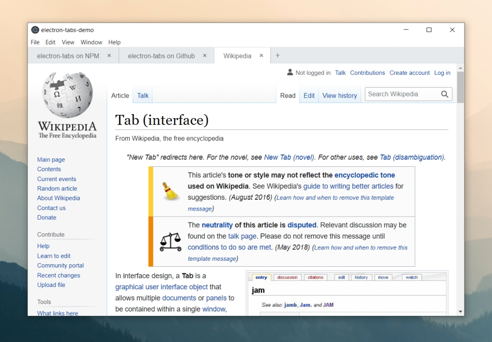

# electron-tabs

> Simple tabs for Electron applications



## Installation

```
$ npm install --save electron-tabs
```

## Demo

```
$ npm run demo
```

## Usage

Add the following elements to the app page:

```html
<div class="etabs-tabgroup">
    <div class="etabs-tabs"></div>
    <div class="etabs-buttons"></div>
</div>
<div class="etabs-views"></div>
```

And call the module in the renderer process:

```javascript
const TabGroup = require("electron-tabs");
```

Then you can initialize a tab group and add tabs to it:

```javascript
let tabGroup = new TabGroup();
let tab = tabGroup.addTab({
    title: "Electron",
    src: "http://electron.atom.io",
    visible: true
});
```

If you don't want to write your own styles, you can also insert the sample electron-tabs stylesheet in the page header:

```html
<link rel="stylesheet" href="node_modules/electron-tabs/electron-tabs.css">
```

### Note
Please note, there is a known issue in some versions of Electron that prevents the process to completely shut down and it remains hanging in Background Processes (Windows 10). If you encounter that issue please use the workaround provided at https://github.com/electron/electron/issues/13939

## API

### Tab Group

Represents the main tab container.

#### `new TabGroup(options)`

`options` must be an object. The following options are available:

* `tabContainerSelector` (default: `".etabs-tabs"`): CSS selector to target the element where tabs are inserted.
* `buttonsContainerSelector` (default: `".etabs-buttons"`): CSS selector to target the element where the "New Tab" button are inserted.
* `viewContainerSelector` (default: `".etabs-views"`): CSS selector to target the element where the view are inserted.
* `tabClass` (default: `"etabs-tab"`): class to add to tab elements.
* `viewClass` (default: `"etabs-view"`): class to add to webview elements.
* `closeButtonText` (default: `"&#10006;"`): "close tab" button text.
* `newTabButtonText` (default: `"&#65291;"`): "New Tab" button text.
* `newTab` (default: `undefined`): arguments to use when `.addTab()` is called without parameters. It can be an object or a function which returns an object. It determines the options to use when the "New Tab" button is triggered. If you leave it undefined then the "New Tab" button won't be displayed.
* `ready` (default: `undefined`): a callback function to call once the tab group is ready. The `TabGroup` instance is passed as the only parameter.

#### `tabGroup.addTab(options)`

Add a new tab to the tab group and returns a `Tab` instance.

* `title`: tab title.
* `src`: URL to the page which will be loaded into the view. This is actually the same than `options.webview.src`.
* `badge`: optional text to put into a badge, badge will be hidden if it's falsey
* `iconURL`: optional URL to the tab icon.
* `icon`: optional code for a tab icon. Can be used with symbol libraries (example with Font Awesome: `icon: 'fa fa-icon-name'`). This attribute is ignored if an `iconURL` was given.
* `closable` (default: `true`): if set to `true` the close button won't be displayed and the user won't be able to close the tab. See also `tab.close()`.
* `webviewAttributes`: attributes to add to the webview tag. See [webview documentation](http://electron.atom.io/docs/api/web-view-tag/#tag-attributes).
* `visible` (default: `true`): set this to `false` if you don't want to display the tab once it is loaded. If set to `false` then you will need to call `tab.show()` to display the tab.
* `active` (default: `false`): set this to `true` if you want to activate the tab once it is loaded. Otherwise you will need to call `tab.activate()`.
* `ready`: a callback function to call once the tab is ready. The `Tab` instance is passed as the only parameter.

#### `tabGroup.getTab(id)`

Retrieve an instance of `Tab` from this `id` (return `null` if not found).

#### `tabGroup.getTabByPosition(position)`

Retrieve an instance of `Tab` from this `position` (return `null` if not found). A negative value is an offset from the right.

To get the tab in the leftmost position:

```javascript
tabGroup.getTabByPosition(1);
```

To get the tab in the rightmost position:

```javascript
tabGroup.getTabByPosition(-1);
```

> Note: Position 0 does not contain a tab.

#### `tabGroup.getTabByRelPosition(position)`

Retrieve an instance of `Tab` from this `position` relative to the active tab (return `null` if not found).
`tabGroup.getNextTab()` is an alias to `tabGroup.getTabByRelPosition(1)`.
`tabGroup.getPreviousTab()` is an alias to `tabGroup.getTabByRelPosition(-1)`.

#### `tabGroup.getActiveTab()`

Return the currently active tab (otherwise return `null`).

#### `tabGroup.getTabs()`

Return all registered tabs.

#### `tabGroup.eachTab(fn, thisArg)`

Loop through the list of tabs in `tabGroup` and execute the `fn` function for each tab. `fn` is called with the following parameters:

* `currentTab`: the current tab object.
* `index`: the index of the current tab being processed.
* `tabs`: the full array of tabs (similar to `tabGroup.getTabs()`).

`thisArg` (optional) is the value to use as `this` when executing `fn`.

### Tab

Instances of `Tab` are returned by the `tabGroup.addTab()` method.

#### `tab.setTitle(title)`

Set tab title.

#### `tab.getTitle()`

Get current tab title.

#### `tab.setBadge(badge)`

Set tab badge.

#### `tab.getBadge()`

Get current tab badge.

#### `tab.setIcon (iconURL, icon)`

Set tab icon (a iconURL or an icon must be given).

#### `tab.getIcon()`

Get current tab icon URL / icon.

#### `tab.setPosition(newPosition)`

Move tab to the specified position. If `position` is 0 then `null` is returned and nothing happens. See [`tabGroup.getTabByPosition`](#tabgroupgettabbypositionposition) for information about positions.

#### `tab.getPosition(fromRight)`

Get the tab position. If `fromRight` is true the index returned is negative and is the offset from the right.

#### `tab.activate()`

Activate this tab. The class "active" is added to the active tab.

#### `tab.show(flag)`

Toggle the "visible" class on the tab. `tab.hide()` is an alias to `tab.show(false)`.

#### `tab.flash(flag)`

Toggle the "flash" class on the tab. `tab.unflash()` is an alias to `tab.flash(false)`.

#### `tab.close(force)`

Close the tab (and activate another tab if relevant). When `force` is set to `true` the tab will be closed even if it is not `closable`.

### Access webview element

You can access the webview element and use its methods with through the `Tab.webview` attribute. See [webview documentation](http://electron.atom.io/docs/api/web-view-tag/#methods).

```javascript
let webview = tab.webview;
webview.loadURL("file://path/to/new/page.html");
```

### Events

The following events are available:

* `tabGroup.on("tab-added", (tab, tabGroup) => { ... });`
* `tabGroup.on("tab-removed", (tab, tabGroup) => { ... });`
* `tabGroup.on("tab-active", (tab, tabGroup) => { ... });`
* `tab.on("webview-ready", (tab) => { ... });`
* `tab.on("title-changed", (title, tab) => { ... });`
* `tab.on("icon-changed", (icon, tab) => { ... });`
* `tab.on("active", (tab) => { ... });`
* `tab.on("visible", (tab) => { ... });`
* `tab.on("hidden", (tab) => { ... });`
* `tab.on("flash", (tab) => { ... });`
* `tab.on("unflash", (tab) => { ... });`
* `tab.on("close", (tab) => { ... });`
* `tab.on("closing", (tab) => { ... });`

## Drag and drop support

Electron-tabs is compatible with [Dragula](https://github.com/bevacqua/dragula) so you can easily make your tabs draggable.

Install Dragula:

```
npm install dragula --save
```

Don't forget to add a link to its stylesheet in the header:

```html
<link rel="stylesheet" href="node_modules/dist/dragula.css">
```

Then call Dragula in your script once tabGroup is ready:

```javascript
const TabGroup = require("electron-tabs");
const dragula = require("dragula");

var tabGroup = new TabGroup({
    ready: function (tabGroup) {
        dragula([tabGroup.tabContainer], {
			direction: "horizontal"
		});
    }
});
```

## License

The MIT License (MIT) - Copyright (c) 2016 Thomas Brouard
